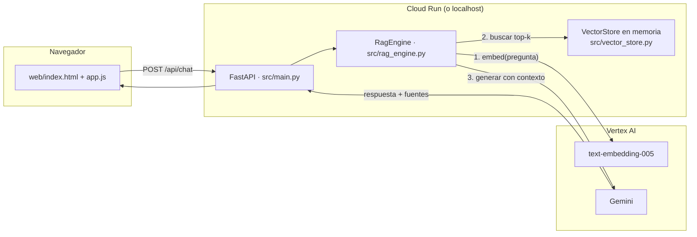

# Conceptos — RAG, embeddings y Vertex AI

## El problema que resuelve RAG

Gemini (como cualquier LLM) solo "sabe" lo que vio en su entrenamiento.
No sabe nada del "Programa Helios" de este laboratorio porque es
inventado — y de la misma forma, no sabría nada de los documentos
internos reales de tu empresa, tus tickets de Jira, o tu código propio.

Hay tres formas de darle ese conocimiento:

| Opción | Cuándo tiene sentido | Problema |
|---|---|---|
| **Fine-tuning** | Cambiar el *comportamiento* del modelo (tono, formato, un patrón de tarea repetitivo) | Caro, lento de iterar, y no es la forma correcta de "enseñarle hechos" — el modelo puede memorizar mal, y actualizar el conocimiento significa reentrenar |
| **Contexto largo** (pegar todo en el prompt) | Pocos documentos, que caben en la ventana de contexto | No escala: más tokens = más costo y más latencia en *cada* pregunta, aunque la respuesta solo necesite un párrafo de un documento |
| **RAG** (este laboratorio) | Muchos documentos, que cambian con el tiempo, y donde cada pregunta solo necesita un fragmento pequeño | Requiere una pieza extra (el índice vectorial) — es lo que este lab construye |

RAG separa el problema en dos pasos: primero **encontrar** los fragmentos
relevantes (retrieval), después **generar** la respuesta usando solo esos
fragmentos como contexto (generation). De ahí el nombre.

## Embeddings: convertir texto en números que se pueden comparar

Un modelo de embeddings (aquí, `text-embedding-005` de Vertex AI) recibe
texto y devuelve un vector de números — por ejemplo, 768 números. Textos
con significado parecido devuelven vectores parecidos, sin importar si
usan las mismas palabras. Es un modelo distinto y mucho más barato que
Gemini: no genera texto, solo lo posiciona en un espacio.

Esto es lo que permite comparar la pregunta del usuario contra cada
fragmento de documento sin que ninguno de los dos mencione las mismas
palabras exactas: "¿cuánto se puede desviar un número al migrar?" y
"Umbrales de reconciliación... 0.01% de diferencia relativa" pueden
tener vectores cercanos aunque no compartan ni una palabra.

### `task_type`: un detalle fácil de pasar por alto

Vertex AI pide indicar si el texto que se embebe es un **documento** que
se va a guardar (`RETRIEVAL_DOCUMENT`) o una **pregunta** que se va a
buscar (`RETRIEVAL_QUERY`). El modelo ajusta el vector distinto según el
caso, para que una pregunta corta quede cerca de los documentos largos
que la responden. Usar el `task_type` equivocado de un lado no da error
— simplemente empeora los resultados de búsqueda en silencio. Ver
[`src/gemini_client.py`](src/gemini_client.py).

## Similitud de coseno, con un ejemplo numérico

Para comparar dos vectores se usa el coseno del ángulo entre ellos: 1.0
si apuntan exactamente igual, 0.0 si son perpendiculares (nada que ver),
-1.0 si son opuestos. Con vectores ya normalizados a longitud 1, el
coseno es simplemente el producto punto — así lo implementa
[`src/vector_store.py`](src/vector_store.py).

Ejemplo con vectores de juguete de 2 dimensiones:

```
pregunta:        [1.0, 0.0]
fragmento A:      [0.9, 0.1]   -> similitud ≈ 0.994  (muy relevante)
fragmento B:      [0.0, 1.0]   -> similitud = 0.0     (nada relevante)
```

El motor de retrieval simplemente calcula esta similitud contra *todos*
los fragmentos guardados y devuelve los `k` con mayor puntaje (`RAG_TOP_K`
en `.env`, por defecto 4).

## Chunking: por qué no se embebe el documento completo

Un documento entero mezcla muchos temas; su embedding sería un promedio
borroso de todos ellos y no se parecería mucho a ninguna pregunta
específica. Por eso [`src/chunking.py`](src/chunking.py) parte cada
documento en fragmentos de ~180 palabras, con 40 palabras de traslape
entre fragmentos consecutivos — para que una idea que quede justo en el
borde de un fragmento no se corte sin que ningún fragmento la contenga
completa.

Fragmentos más chicos = búsquedas más precisas pero más llamadas/costo y
menos contexto por fragmento. Fragmentos más grandes = lo contrario. 180
palabras es un punto de partida razonable para documentación tipo
markdown; para código fuente normalmente conviene partir por función o
clase, no por conteo de palabras.

## El prompt: cómo se combina retrieval + generación

[`src/rag_engine.py`](src/rag_engine.py) arma un prompt así:

```
<instrucciones del sistema: responde solo con el CONTEXTO, si no está di que no sabes>

CONTEXTO:
Fuente: 03_proceso_validacion.md
<texto del fragmento 1>

Fuente: 02_arquitectura_gcp.md
<texto del fragmento 2>
...

PREGUNTA: <la pregunta del usuario>
```

La instrucción de "si no está en el CONTEXTO, dilo" es lo que reduce
alucinaciones — sin ella, el modelo tiende a rellenar huecos con
información plausible pero inventada, aunque tenga contexto real
disponible.

## Arquitectura de este laboratorio



## Hacia dónde crece esto

Este laboratorio usa deliberadamente la versión más simple de cada
pieza. Los siguientes pasos naturales, en orden de cuándo tendrían
sentido:

1. **Base vectorial real** — `VectorStore` en memoria funciona hasta unos
   pocos miles de fragmentos, y se reconstruye en cada arranque. Con más
   documentos, o si necesitas que el índice persista sin recalcularlo,
   el siguiente paso es **Vertex AI Vector Search** (servicio gestionado
   de búsqueda aproximada) o una base de datos con soporte de vectores
   (AlloyDB/Cloud SQL con `pgvector`).
2. **Documentos que cambian** — aquí la ingesta es manual
   (`python -m src.ingest`). En un sistema real conviene un *pipeline*
   (por ejemplo, un DAG de Cloud Composer o un trigger de Cloud
   Functions sobre un bucket) que reingiera automáticamente cuando los
   documentos fuente cambian.
3. **Multi-agente** — este laboratorio implementa un solo rol ("Agente de
   Consulta"). Un sistema como el descrito en `data/docs/00_vision_migracion.md`
   (Extractor, Conversor, Validador, Documentador) encadena varios
   agentes especializados, cada uno con su propio prompt y a veces su
   propio modelo, orquestados por algo como Cloud Composer/Airflow en vez
   de por una sola llamada HTTP.
4. **Evaluación** — antes de confiar en las respuestas de un sistema RAG
   en producción, se mide con un set de preguntas de referencia (qué tan
   seguido recupera el fragmento correcto, qué tan seguido la respuesta
   es correcta) en vez de solo probarlo a mano como en este lab.
