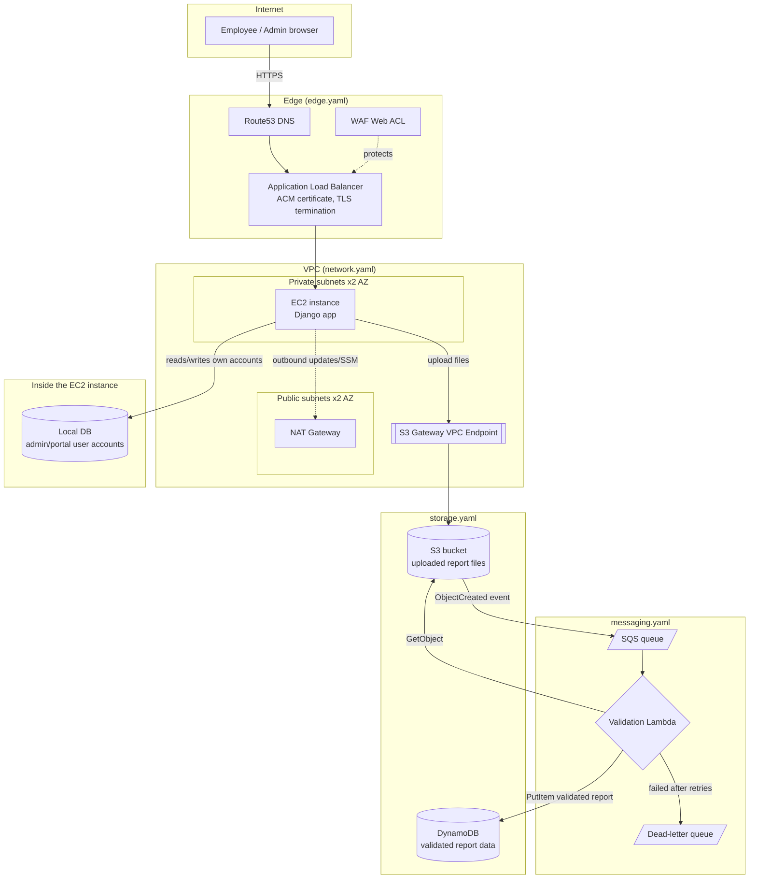

# MHP Expense Portal — Infrastructure as Code

CloudFormation templates for deploying the `lab2/` Django app
("MHP by Porsche") to AWS. This is **infrastructure scaffolding only** —
no AWS account, region, or domain name was available when it was
written, so every account-specific value is a clearly labeled
placeholder default meant to be adjusted before a real deploy. See
`docs/adr/` for the reasoning behind every non-obvious choice.

## Why this exists

The app currently runs from a laptop with SQLite. This project defines,
as reviewable YAML, what a real AWS deployment would look like for an
internal tool with well under 100 users: file storage, an app server,
an async file-validation pipeline, and the network/TLS/WAF baseline
around it — sized for that scale rather than over-built, but following
AWS security best practices throughout.

## Architecture



**Key design decisions, each with its own ADR:**

| Decision | ADR |
|---|---|
| CloudFormation, not Terraform | [0001](docs/adr/0001-cloudformation-over-terraform.md) |
| Independent stacks, naming-convention-constructed ARNs instead of heavy cross-stack imports | [0002](docs/adr/0002-independent-stacks-naming-convention.md) |
| Single EC2 instance, not an Auto Scaling group | [0003](docs/adr/0003-single-instance-ec2-not-autoscaling.md) |
| ALB included solely as the ACM/WAF attachment point, not for load balancing | [0004](docs/adr/0004-alb-required-for-tls-waf-despite-low-scale.md) |
| EC2 in a private subnet, S3 reached via a Gateway VPC Endpoint | [0005](docs/adr/0005-private-subnet-ec2-with-s3-gateway-endpoint.md) |
| S3 → SQS → Lambda → DynamoDB async validation pipeline | [0006](docs/adr/0006-async-validation-pipeline.md) |
| User accounts stay in the app's own local DB; DynamoDB holds validated report data only | [0007](docs/adr/0007-dual-datastore-split.md) |
| IAM roles only — no IAM users, no access keys | [0008](docs/adr/0008-iam-roles-not-users.md) |
| Security baseline: encryption, WAF managed rules, IMDSv2, least privilege | [0009](docs/adr/0009-security-baseline.md) |

## Layout

```
infra/
├── docs/adr/          Architecture Decision Records (read these first)
├── templates/         CloudFormation templates, one per concern
│   ├── network.yaml    VPC, subnets, NAT, S3 Gateway Endpoint, security groups, flow logs
│   ├── storage.yaml     S3 bucket (report files), DynamoDB table (validated reports)
│   ├── security.yaml    IAM roles + instance profile (no users, no keys)
│   ├── messaging.yaml    SQS + DLQ, validation Lambda, S3 notification wiring
│   ├── compute.yaml      EC2 launch template + instance
│   └── edge.yaml          ALB, ACM certificate, Route53 record, WAF
├── parameters/         Per-environment parameter values (real files git-ignored)
│   └── dev.example.json  Copy to dev.json and fill in real values
└── scripts/
    ├── lint-templates.ps1  Validate every template with cfn-lint (no AWS account needed)
    └── deploy-stack.ps1    Deploy one stack with its matching parameter file
```

## Deployment order

Each stack after `network` needs output values (subnet IDs, security
group IDs, role ARNs) from the ones before it — copy them into your
`parameters/<env>.json` as you go (see `parameters/dev.example.json`
for exactly which values each stack needs):

1. `network` — no dependencies.
2. `storage` — no dependencies.
3. `security` — no dependencies (can run in parallel with storage).
4. `messaging` — needs `security`'s role ARNs.
5. `compute` — needs `network`'s subnet/security-group IDs and
   `security`'s instance profile ARN.
6. `edge` — needs `network`'s VPC/subnet/security-group IDs and
   `compute`'s instance ID.

```powershell
# from a machine with AWS credentials configured
./scripts/deploy-stack.ps1 -StackName network
./scripts/deploy-stack.ps1 -StackName storage
./scripts/deploy-stack.ps1 -StackName security
# ...fill in messaging's role ARNs in parameters/dev.json from the
# security stack's outputs, then:
./scripts/deploy-stack.ps1 -StackName messaging
# ...fill in compute's values, then:
./scripts/deploy-stack.ps1 -StackName compute
# ...fill in edge's values, then:
./scripts/deploy-stack.ps1 -StackName edge
```

## Validating without an AWS account

`cfn-lint` checks template syntax and semantics entirely offline —
no AWS account, credentials, or network access needed:

```powershell
./scripts/lint-templates.ps1
```

(`cfn-lint` is installed in `lab2/.venv`, not in `lab2/requirements.txt`
— it's a template-authoring tool, not a Django runtime dependency.)

## Before a real deploy, still to do

This baseline is deliberately incomplete in a few places that need a
real AWS account/domain to finish, or that are application-level work
outside this infrastructure project's scope:

- **`DomainName` / `HostedZoneId`** in `edge.yaml` are placeholders —
  the ACM certificate won't validate and no DNS record will be created
  until these point at a real domain/hosted zone you own.
- **Health check endpoint**: the ALB target group checks
  `HealthCheckPath` (default `/healthz`) — the Django app doesn't expose
  this yet; add a simple unauthenticated health view before deploying
  `edge.yaml`, or the target will never register healthy.
- **App bootstrap**: `compute.yaml`'s instance `UserData` is a stub. It
  doesn't install/run the Django app — that needs a real deploy
  mechanism (baked AMI, CI-driven deploy, or a fuller bootstrap script)
  before the instance behind the ALB actually serves anything.
- **Validation Lambda logic**: `messaging.yaml`'s `ValidationFunction`
  is a working skeleton (confirms the S3 object exists and is
  non-empty), not the real validation rules — extend it to mirror
  `lab2/expenses/pdf_analysis.py` and `image_analysis.py`'s checks
  before trusting its DynamoDB output.
- **WAF in COUNT mode first**: flip the managed rule groups from
  `OverrideAction: None` to count-only, review sampled requests in the
  WAF console for false positives against real app traffic, then
  switch to blocking (see [ADR 0009](docs/adr/0009-security-baseline.md)).
- **Real parameter files**: copy `parameters/dev.example.json` to
  `parameters/dev.json` (git-ignored) and fill in your account's real
  values as each stack's outputs become available.
