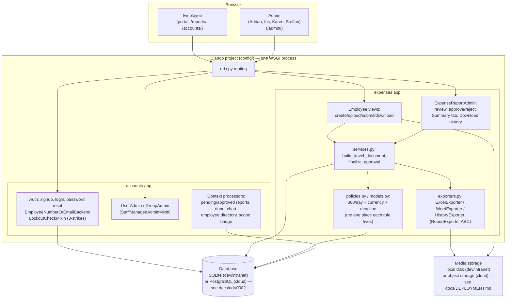

# Architecture

This document has two parts: a **system-level diagram** — everything the
app is made of, and how a request actually flows through it — and then a
deep dive into **how the Django Admin approval interface specifically is
put together** (the Dashboard, the Employees directory, a report's review
page), since none of that is default Django Admin behavior. It complements
`DATA_MODEL.md` (the schema and business rules) and `DEPLOYMENT.md`
(infrastructure, including cloud-hosting considerations); this one is
about *how the app is built*, for anyone picking up the code after this
round of changes. See `docs/adr/` for the individual decisions behind the
choices explained here, with their alternatives and trade-offs, and
`docs/USER_STORIES.md` for what the app does, told from each role's
point of view rather than from the code's.

## System architecture at a glance

One Django project (`config/`), two apps (`accounts`, `expenses`), one
process, one database. There's no queue, no cache layer, no
microservices, no separate frontend build — deliberately: this is a
single internal tool for a low-traffic workflow (submit a travel expense
report, get it approved), and every one of those things would be
solving a scaling problem this app doesn't have. `docs/adr/0001-...`
covers why a monolith was chosen over splitting anything out.

- **One WSGI process serves everything** — the employee portal
  (Bootstrap templates) and the admin approval interface (reskinned
  Django Admin) are the same Django project and process, separated by
  URL prefix and by `is_staff`, not by being separate deployments. They
  no longer share one authentication mechanism, though: the portal
  authenticates from JWT cookies and Admin keeps Django's session-based
  login, since `django.contrib.admin` has no supported way to run on a
  stateless token (see docs/adr/0011-jwt-web-authentication.md).
- **`accounts` is the lower-level app**: users, login, permissions,
  Dashboard context processors. `expenses` depends on it (every report
  belongs to a `User`); `accounts` never imports from `expenses` at
  module load time (only inside function bodies, to dodge a circular
  import — see `accounts/context_processors.py`).
- **The database is the only stateful service** the app talks to — no
  Redis, no message broker, no search index. Sessions, the audit trail,
  every business rule's evaluation, all of it reads/writes the same
  relational database.
- **Media storage is local disk by default** (`media/uploads/`,
  `media/reports/`) — fine on the intranet's persistent volume
  (`docker-compose.yml`), a real limitation in most cloud container
  platforms (see "Cloud hosting considerations" in `docs/DEPLOYMENT.md`).

## Admin UI architecture

This section explains how the Django Admin approval interface is put
together — the Dashboard, the Employees directory, and a report's review
page — since none of it is default Django Admin behavior.

### Why a custom admin UI at all

Django Admin's default index page is a flat list of every registered
model, with no way to show a report's data inline or group things by
workflow. Rather than replace Django Admin with a separate app, every
customization here **extends** Django's own templates and hooks
(`ModelAdmin.get_urls()`, template block overrides, context processors) —
so permissions, CSRF, the changeform's POST handling, and everything else
Django Admin already does correctly are untouched. Nothing here is a
parallel framework; it's Django Admin with its rendering reshaped.

## The Dashboard (`templates/admin/index.html`)

Six tabs, switched with a small vanilla-JS click handler (no framework):
**Dashboard**, **Employees**, **Reports**, **Users & Groups**, **Policies**,
**Help**.

- **Dashboard**: the "what needs attention right now" screen, styled after
  enterprise portal home pages (SAP SuccessFactors-style KPI tiles) rather
  than a stacked list of separate widgets. A short greeting header, then a
  CSS-grid row of large tiles (`.kpi-tiles`) — Pending Review, Approved,
  Rejected, and the approval-rate donut — each tile *is* the link to that
  filtered list, so there's no separate banner repeating the same number.
  Below that, a real `<table>` of expense reports with a **Pending /
  Approved** filter toggle (`.dashboard-subtabs`, plain CSS `hidden`
  attribute swap, no framework) — so an admin can browse and compare both
  without leaving the Dashboard or opening the full Reports changelist —
  and "Recent actions" collapsed behind a native `
` so day-to-day
  admin-log noise doesn't take up scroll space by default. Deliberately
  kept to what fits on one screen — this is a notification center, not a
  full report browser (that's what the Reports tab/changelist is for).
- **Employees**: a client-side-searchable, card-row list of every employee
  registered on the platform (not just ones with a report), each showing
  their report count and, if their latest report is still `submitted`, a
  highlighted amber row with an "Access" button straight to it.
- **Reports** / **Users & Groups**: Django's own `app_list` include, split
  by `app_label` via the `apps_in` template filter (`accounts/
  templatetags/admin_extras.py`) — the Expenses app's model links in one
  tab, Accounts + Auth (Users, Groups, LoginEvent) in the other. Users &
  Groups is reachable by **any** `is_staff` account, not just
  `is_superuser` — see `accounts/admin.py:StaffManagedAdminMixin` and
  `docs/adr/0008-admin-access-model.md`. This tab layout is also why
  Django's built-in left navigation sidebar is turned off site-wide
  (`admin.site.enable_nav_sidebar = False` in `accounts/apps.py`): it
  duplicated exactly this, on every single admin page, including while
  reviewing one report.
- **Policies** / **Help**: static reference content — every business rule
  in plain language, and an FAQ that tells an admin exactly where to click
  for common situations. Styled as secondary tabs (lighter, smaller text)
  since they're reference material, not part of the day-to-day workflow —
  the point of a help section is that it's there when needed and out of
  the way otherwise.

All the tab content comes from context processors
(`accounts/context_processors.py`), each computing its own
department-scoped queryset the same way (HR/superuser sees everything, a
department admin sees only their own): `pending_reports_notification`,
`approved_reports_table`, `approval_chart`, `employee_directory`,
`admin_scope_badge`.

## A report's review page (change form)

`templates/admin/expenses/expensereport/change_form.html` extends Django's
own `admin/change_form.html` and adds two things, without changing how the
form itself submits:

1. **Tabs**: Summary (default) / Report / Review / Documents / History.
   Django already renders the `ModelAdmin`'s fieldsets *and* both inlines
   (`TravelDocumentInline`, `AuditLogInline`) as sibling `<fieldset
   class="module">` elements. A small script (in the `after_related_objects`
   block, so it runs after everything it needs already exists in the DOM)
   reads each fieldset's `<h2>` heading text and tags it with a tab name,
   then a click handler toggles `display: none` on whichever tabs aren't
   active. **Every field stays in the DOM the entire time** — nothing is
   conditionally rendered or removed — so the inline formsets' management-
   form data and every field's value are unaffected by which tab happens
   to be visible when the form is POSTed. `ExpenseReportAdmin.fieldsets`
   (`expenses/admin/reports.py`) is split into "Report" (who/what — title,
   description, supervisor) and "Review" (status, review note, CEO clause,
   trip financials, the $60/day breakdown) specifically so this script has
   two fieldsets to classify instead of one long one.
2. **The Summary tab's content** (manually placed in the `form_top` block,
   not a fieldset): the Excel/Word download buttons, and an HTML preview of
   the same consolidated data those two files contain (trip info, the
   expense table, the $60/day policy flag) — reviewable without opening
   either file. Before a report is approved, there's no saved snapshot yet,
   so the buttons point at two small custom admin routes instead
   (`ExpenseReportAdmin.get_urls()` → `preview_excel` / `preview_word`)
   that generate the file live, the same way the employee's own portal
   already could (`expenses/views/exports.py`) — scoped through
   `get_queryset()` so a department admin can only preview a report
   they're actually allowed to see.
3. **A repurposed "Download history" object-tool** (`templates/admin/
   expenses/expensereport/change_form_object_tools.html`): Django renders
   this row above the change form via a per-model-overridable template
   (`InclusionAdminNode` resolves `admin/<app>/<model>/change_form_object_
   tools.html` before falling back to the site-wide default), so this
   override only affects `ExpenseReport` — no other model's change form
   changes. Django's own version puts a "History" link here pointing at
   its raw `LogEntry`-based change log, which is redundant with the
   Documents/History tabs above and isn't very actionable on its own; this
   override keeps the same object-tools slot (so it still renders as the
   theme's black pill button via the `--object-tools-bg` CSS variable, no
   extra styling needed) but points it at `download_history`
   (`ExpenseReportAdmin.get_urls()`), which builds and serves a `.docx` of
   the report's actual audit trail — every status change, who made it, and
   any note, rejection notes included — via `expenses/history_export.py`
   and the `HistoryExporter` in `expenses/exporters.py`. Always built live
   from `report.audit_log`, never gated on approval and never a saved
   snapshot, since the point is to see the trail as it stands right now.

## Two design patterns applied deliberately

- **Decorator** (`accounts/decorators.py:staff_permission`,
  `expenses/views/decorators.py:draft_only`): wraps cross-cutting checks
  that were previously duplicated verbatim across multiple methods/views.
  `staff_permission` lives in `accounts/` (not `expenses/admin/`, where it
  started) because `accounts.admin.UserAdmin`/`GroupAdmin` use it too, now
  that Users & Groups access is is_staff-based rather than
  superuser-only — see the "Decorator pattern" section of the main
  `README.md` for the before/after.
- **Formal exporter interface** (`expenses/exporters.py:ReportExporter`,
  an `ABC`): `ExcelExporter`/`WordExporter`/`HistoryExporter` are the only
  three places that know how to turn a report into bytes; `finalize_approval`
  (services.py), the employee-facing download views, and the admin's
  preview/download routes above all go through the same three instances
  (`excel_exporter`, `word_exporter`, `history_exporter`) instead of each
  repeating their own "build → BytesIO → serve" ceremony. `HistoryExporter`
  is the odd one out by design — it never produces a saved snapshot, since
  `finalize_approval` never calls it; it only ever builds live.

## One rule, one place: how the $60/day policy is centralized

`ExpenseReport.daily_totals()` (`expenses/models.py`) is the **only**
place that decides whether a day is a policy violation — including the
currency conversion and the flight/hotel exemption (a day with a flight or
hotel charge routinely clears $60 on its own, so it's flagged
informationally, never as a violation). Every surface that shows this —
the employee's report detail page, the admin changelist's policy column,
the change-form's Summary tab and Review tab, the generated Excel, and the
generated Word — calls this same method and only decides *how* to render
what it returns (`over_limit`, `has_flight_or_hotel`, `total_usd`), never
re-derives any of it. Concretely, that means:

- Changing the daily limit is a one-line edit in `expenses/policies.py`
  (`DAILY_LIMIT_USD`).
- Changing which document types are exempt is a one-line edit in
  `daily_totals()` (`justified_types`).
- Changing the MXN/USD exchange rate is a one-line edit in
  `expenses/policies.py` (`USD_MXN_RATE`) — the only place
  `TravelDocument.amount_usd` reads it from.
- None of those edits require touching `excel.py`, `word_export.py`,
  `expenses/admin/reports.py`, or any template — they only read the
  result.

**Why the currency conversion exists at all**: `TravelDocument.amount` is
whatever the employee typed in, in whatever currency they actually paid
in (`TravelDocument.currency`, USD or MXN) — comparing that raw figure
against `DAILY_LIMIT_USD` (always dollars) would be comparing pesos to
dollars as if they were the same unit. A day of MXN taxi receipts adding
up to $292.98 pesos is really about $17 USD — well under the policy — but
would incorrectly flag as a $60+ violation if the peso figure were used
directly. `amount_usd` is the only value ever compared against the limit
or summed into a report total (`ExpenseReport.total_amount`); `amount`
itself is left untouched as the as-submitted record.

This is the same "policy separated from schema/presentation" principle
`expenses/policies.py`/`validators.py` already established for the other
business rules (submission deadline, trip-span validation, file size) —
`daily_totals()` is that same idea applied to a rule with more than one
possible outcome (violation / justified / fine) instead of a plain
threshold.

## Adding a new admin tab or panel

1. **A new Dashboard tab**: add a `<button data-tab="...">` next to the
   existing ones, a `
` with
   its content, and (if it needs data) a new context processor registered
   in `config/settings.py`'s `TEMPLATES[0]['OPTIONS']['context_processors']`.
   The existing tab-switch script needs no changes — it queries
   `.admin-tab-btn` / `.admin-tab-panel` generically.
2. **A new change-form tab**: add a button to `.change-form-tabs`, add the
   heading text → tab name mapping to `HEADING_TO_TAB` in the script, and
   either add a new `ModelAdmin` fieldset with that `<h2>` title, or a new
   inline (Django names inline fieldsets after `verbose_name_plural`), or a
   manually-placed `
` like the Summary tab.
