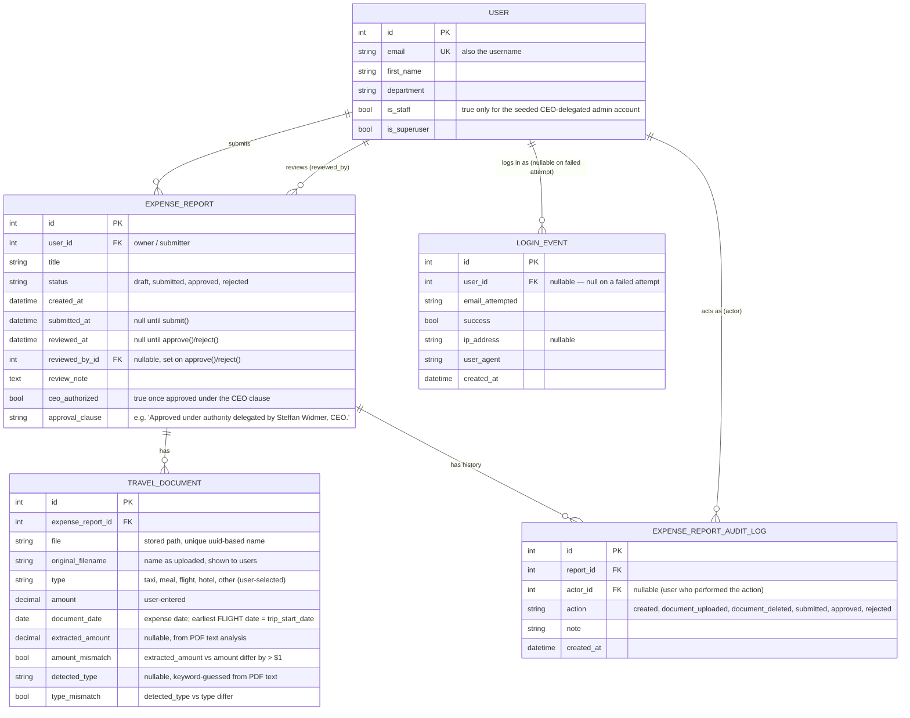

# Data model & traceability

This document is the reference for how the database relations support the
admin's security/traceability view: the history of every report a user has
submitted, and the history of every login/session against the platform.

## Entity-relationship diagram

## Why two history tables (not just fields on ExpenseReport)

`ExpenseReport` keeps the *current* state (status, reviewed_by, reviewed_at,
review_note) — enough to render the employee's and admin's screens without
extra joins. That's not enough for traceability on its own: it only shows
the *last* transition, not the full timeline, and it's silent on document
uploads/deletions.

- **`ExpenseReportAuditLog`** is the append-only timeline per report:
  `created → document_uploaded (×N) → document_deleted (×N)? → submitted →
  approved | rejected`, each row stamped with who (`actor`) and when. It's
  written from `expenses/views.py` (employee actions) and
  `expenses/admin.py` (`ExpenseReportAdmin.save_model`, approve/reject).
  It is registered read-only in Django Admin
  (`ExpenseReportAuditLogAdmin`, no add/change/delete permissions) as the
  admin's audit view, and also shown inline on each report's admin page.

- **`LoginEvent`** is the session/authentication trail: one row per login
  attempt, successful or not, with the IP and user agent, written via
  Django's `user_logged_in` / `user_login_failed` signals
  (`accounts/signals.py`, wired up in `accounts/apps.py`). It's registered
  read-only in Django Admin (`LoginEventAdmin`) so the admin can review who
  has been accessing the platform, from where, and whether there have been
  failed attempts — a basic security/anomaly signal.

Both are intentionally **immutable from the admin UI** (`has_add_permission`,
`has_change_permission`, `has_delete_permission` all return `False`): an
audit trail that can be edited after the fact isn't one.

## How the governance requirements map onto this model

- **Ordered by submission date**: `ExpenseReportAdmin.ordering =
  ["-submitted_at"]` — the approval queue is always most-recently-submitted
  first.
- **$60/day policy**: `ExpenseReport.daily_totals()` groups `TravelDocument`
  rows by `document_date` and flags any day whose sum exceeds
  `DAILY_LIMIT_USD` (`expenses/models.py`). Nothing is stored redundantly —
  it's computed from `TravelDocument`, shown to the employee (report detail
  page), the admin (list + detail), and the Excel export.
- **PDF pre-check at upload time**: `expenses/pdf_analysis.py` reads the PDF
  text layer for every uploaded PDF and fills `extracted_amount` /
  `detected_type` on the `TravelDocument` row immediately, flagging
  `amount_mismatch` / `type_mismatch` — so a policy issue can surface before
  a human ever reviews the report, not just at approval time.
- **Submission deadline (flight date + 30 days)**: `ExpenseReport.trip_start_date`
  looks for the earliest `FLIGHT`-type document (falling back to the
  earliest document of any type), and `submission_deadline` /
  `is_past_deadline` are computed from it. `submit()` refuses to move a
  report out of `draft` once the deadline has passed.
- **CEO approval clause (Steffan Widmer)**: `ExpenseReport.approve()` takes a
  mandatory `ceo_clause_ack` argument and refuses to approve without it; on
  success it stamps `ceo_authorized=True` and
  `approval_clause="Approved under authority delegated by Steffan Widmer, CEO."`.
  The admin form (`ExpenseReportAdminForm`) surfaces this as a required
  checkbox that must be ticked to approve — rejecting doesn't need it.
