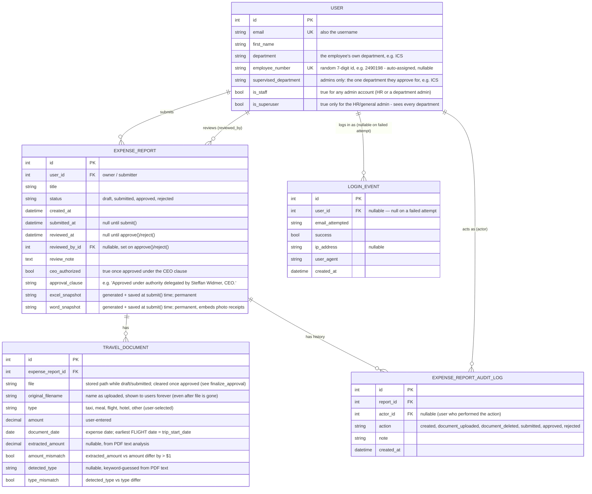

# Data model & traceability

This document is the reference for how the database relations support the
admin's security/traceability view: the history of every report a user has
submitted, and the history of every login/session against the platform.

## Entity-relationship diagram

## Why two history tables (not just fields on ExpenseReport)

`ExpenseReport` keeps the *current* state (status, reviewed_by, reviewed_at,
review_note) — enough to render the employee's and admin's screens without
extra joins. That's not enough for traceability on its own: it only shows
the *last* transition, not the full timeline, and it's silent on document
uploads/deletions.

- **`ExpenseReportAuditLog`** is the append-only timeline per report:
  `created → document_uploaded (×N) → document_deleted (×N)? → submitted →
  approved | rejected`, each row stamped with who (`actor`) and when. It's
  written from `expenses/views/` (employee actions) and
  `expenses/admin/reports.py` (`ExpenseReportAdmin.save_model`, approve/reject).
  It is registered read-only in Django Admin
  (`ExpenseReportAuditLogAdmin`, no add/change/delete permissions) as the
  admin's audit view, and also shown inline on each report's admin page.

- **`LoginEvent`** is the session/authentication trail: one row per login
  attempt, successful or not, with the IP and user agent, written via
  Django's `user_logged_in` / `user_login_failed` signals
  (`accounts/signals.py`, wired up in `accounts/apps.py`). It's registered
  read-only in Django Admin (`LoginEventAdmin`) so the admin can review who
  has been accessing the platform, from where, and whether there have been
  failed attempts — a basic security/anomaly signal.

Both are intentionally **immutable from the admin UI** (`has_add_permission`,
`has_change_permission`, `has_delete_permission` all return `False`): an
audit trail that can be edited after the fact isn't one.

## How the governance requirements map onto this model

- **Ordered by submission date**: `ExpenseReportAdmin.ordering =
  ["-submitted_at"]` — the approval queue is always most-recently-submitted
  first.
- **$60/day policy**: `ExpenseReport.daily_totals()` groups `TravelDocument`
  rows by `document_date` and flags any day whose sum exceeds
  `DAILY_LIMIT_USD` (`expenses/policies.py`). Nothing is stored redundantly —
  it's computed from `TravelDocument`, shown to the employee (report detail
  page), the admin (list + detail), and the Excel/Word exports.
- **PDF pre-check at upload time**: `expenses/pdf_analysis.py` reads the PDF
  text layer for every uploaded PDF and fills `extracted_amount` /
  `detected_type` on the `TravelDocument` row immediately, flagging
  `amount_mismatch` / `type_mismatch` — so a policy issue can surface before
  a human ever reviews the report, not just at approval time.
- **Submission deadline (flight date + 30 days)**: `ExpenseReport.trip_start_date`
  looks for the earliest `FLIGHT`-type document (falling back to the
  earliest document of any type), and `submission_deadline` /
  `is_past_deadline` are computed from it. `submit()` refuses to move a
  report out of `draft` once the deadline has passed.
- **CEO approval clause (Steffan Widmer)**: `ExpenseReport.approve()` takes a
  mandatory `ceo_clause_ack` argument and refuses to approve without it; on
  success it stamps `ceo_authorized=True` and
  `approval_clause="Approved under authority delegated by Steffan Widmer, CEO."`.
  The admin form (`ExpenseReportAdminForm`, `expenses/admin/forms.py`) surfaces this as a required
  checkbox that must be ticked to approve — rejecting doesn't need it.
- **One report = one trip**: `validate_trip_span()` (`expenses/policies.py`)
  rejects a document whose date is more than `MAX_TRIP_SPAN_DAYS` (21) away
  from the rest of the report's documents — checked both when a report is
  created with several attachments at once and when a single document is
  added afterward. Nothing is persisted if the check fails.
- **Max 4 pages, charge usually on page 1-2**: `pdf_analysis.validate_pdf_page_count`
  rejects a PDF over `MAX_PDF_PAGES` (4); `analyze_pdf` reads every page but
  only searches the first `PRIORITY_PAGE_COUNT` (2) for the amount/type,
  falling back to the rest of the document only if nothing is found there.
- **Employee number**: `User.employee_number` (accounts/models.py) is a
  random, unique 7-digit id assigned automatically — at signup
  (`SignUpForm.save()`), when an admin creates a user directly
  (`UserAdmin.save_model`), and, for accounts that existed before this field
  was added, via a one-off data migration
  (`accounts/migrations/0005_backfill_employee_numbers.py`).
- **Department-scoped approval + notifications**: `User.supervised_department`
  marks a staff account as the approver for one department (e.g. Adrian
  Heymes → `"ICS"`); `ExpenseReportAdmin.get_queryset` filters the report
  list by `user__department == request.user.supervised_department` for
  anyone who isn't a superuser. Because Django admin resolves a single
  report's change page through that same queryset, opening another
  department's report by guessing its URL doesn't leak it either — admin
  treats it as "object not found" and redirects away, it never renders.
  (`has_module_permission`/`has_view_permission`/`has_change_permission` are
  overridden to allow any `is_staff` account in — the queryset above is
  what actually decides which reports they can see or act on, not Django's
  separate per-model Permission objects.) The HR admin (`is_superuser=True`)
  has no `supervised_department` and sees everything.
  `accounts/context_processors.py:pending_reports_notification`
  runs the same scoping to compute the "N pending review expenses" count
  (and their $ total, and the actual row list for the Dashboard tab's
  table) shown on the admin dashboard (`templates/admin/index.html`) —
  both are driven by the same two fields, so they can't disagree with each
  other. `accounts/context_processors.py:approval_chart` reuses the exact
  same scoping again for the approved-vs-rejected donut chart (and the
  historical approved $ total), and `recent_review_notification` mirrors
  it on the employee side (filtered to `user=request.user` instead of by
  department) for the "your report was approved/rejected" banner, note
  included. The dashboard is organized into three tabs (Dashboard /
  Reportes / Cuentas y permisos, via `accounts/templatetags/admin_extras.py:
  apps_in`) so account/permission management stays visually separate from
  the approval workflow.
- **Excel/Word snapshots replace the originals, once approved**:
  `ExpenseReport.excel_snapshot` / `word_snapshot` are generated once, in
  `expenses/services.py:finalize_approval()`, right after a successful
  `approve()` (same transaction, triggered from
  `ExpenseReportAdmin.save_model`) — not at submission. While a report is
  only submitted and pending review, the original files are still there
  (an admin or the employee may need to check them before deciding), and
  the Excel/Word download links generate a preview on the fly instead of
  serving a saved snapshot. Only after both are saved as part of approval
  does it clear every `TravelDocument.file` on the report — the row itself
  (type/amount/date/flags) is untouched, so `daily_totals()`, the admin,
  and both history views keep working from the DB fields alone. A rejected
  report is untouched by this: there's no resubmission flow, so its
  originals stay available indefinitely. This was a deliberate reversal of
  an earlier decision to keep originals forever: storing every employee's
  raw uploads indefinitely wasn't considered sustainable, so the two
  generated documents (with an embedded thumbnail for photo receipts,
  captured before deletion) became an approved report's permanent record
  instead. The two files are named per RH's convention — employee name,
  submission date, employee number, and an `APROBADO` marker (see
  `expenses/naming.py:export_basename()`).
- **Brute-force lockout**: `accounts/security.py:is_account_locked()` reads
  `LoginEvent` (no separate lockout field) — 3 consecutive failures for an
  email blocks the next login outright, even with the right password.
  `accounts/views.py:PasswordResetConfirmView` writes a synthetic
  `LoginEvent(success=True)` when a reset completes, which is what actually
  clears the lockout window.
