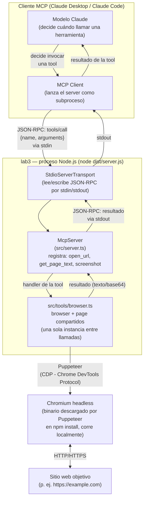
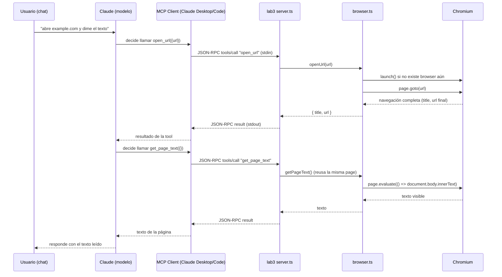

# Architecture

Este documento explica **qué es lab3 y cómo funciona de punta a punta**:
qué proceso corre, qué protocolo habla, cómo llega un mensaje de Claude
hasta Chromium y de regreso, y — porque fue la pregunta que originó este
documento — **por qué esto no es Infraestructura como Código**, aunque
"instalar Chromium" y "npm install" suenen a aprovisionamiento de algo.
Ver `docs/adr/` para el porqué de cada decisión individual, con sus
alternativas y consecuencias; este documento es el mapa de conjunto.

## ¿Es esto Infraestructura como Código (IaC)?

**No.** Vale la pena ser explícito porque este mismo repo *sí* tiene un
ejemplo real de IaC — `lab2/infra/` — y comparar los dos deja claro la
diferencia:

| | `lab2/infra/` (IaC real) | `lab3/` (este lab) |
|---|---|---|
| Qué describe | Recursos de **nube** (VPC, contenedor, base de datos, red) que no existen hasta que una plantilla los crea | Un **proceso local** (`node dist/server.js`) que ya corre con solo tener Node instalado |
| Herramienta | CloudFormation (plantillas declarativas `.yaml`/`.json`) | Ninguna — es una app de Node.js normal |
| Qué "aprovisiona" | Servidores, redes, almacenamiento — estado que vive en la nube de AWS | Nada remoto. `npm install` solo descarga **dependencias de código** (paquetes npm) y, como efecto secundario de uno de esos paquetes, un **binario de Chromium a disco local** |
| Se destruye/recrea con | `aws cloudformation delete-stack` / `deploy` | `rm -rf node_modules dist` — es limpiar una carpeta, no desmantelar infraestructura |
| Documentado en | `lab2/infra/README.md`, `lab2/docs/DEPLOYMENT.md` | Este archivo |

Lo que sí es cierto, y probablemente lo que generó la duda: **la
instalación de Chromium se parece a aprovisionar un recurso** porque es un
binario pesado descargado automáticamente durante `npm install`, no un
`import` de código fuente como el resto de las dependencias. Pero sigue
siendo **local, efímero y reproducible desde `package.json`** — no hay
un servidor remoto que "existe" gracias a este lab, ni estado que
persista fuera de tu máquina. Si acaso, es más parecido a cómo lab2
depende de una base de datos SQLite local (un archivo en disco, no un
servicio provisionado) que a `lab2/infra/`.

## Qué es lab3, en una frase

Un **proceso Node.js** que implementa el lado *servidor* del **Model
Context Protocol (MCP)** — habla JSON-RPC 2.0 por **stdin/stdout** con
quien lo lanzó (Claude Desktop o Claude Code) — y que, cuando el modelo
invoca una de sus tres herramientas, controla una instancia de
**Chromium headless** vía Puppeteer para abrir una URL, leer su texto o
tomar una captura.

## Diagrama de componentes y flujo



- **Un solo proceso, un subproceso hijo del cliente MCP**: cuando Claude
  Desktop/Claude Code lee `.mcp.json`, ejecuta `node dist/server.js`
  como proceso hijo y le habla por sus pipes estándar (stdin/stdout) — no
  hay puerto de red, no hay servidor HTTP escuchando (ver
  `docs/adr/0003-stdio-transport.md` para por qué stdio y no HTTP/SSE).
  `stderr` queda libre para logs de diagnóstico sin contaminar el
  protocolo (`server.ts` lo usa en el `catch` final).
- **`McpServer` (SDK oficial) es solo un enrutador**: registra las tres
  herramientas con su nombre, descripción y *schema* de entrada
  (`zod`), y llama al handler correspondiente cuando llega un mensaje
  `tools/call` que coincide. No sabe nada de Chromium — esa lógica vive
  enteramente en `browser.ts`.
- **`browser.ts` mantiene un único `Browser`/`Page` compartido** entre
  llamadas (variables de módulo, no una por request) — ver
  `docs/adr/0005-shared-browser-instance.md`. Esto es lo que permite que
  `open_url` → `get_page_text` → `screenshot` operen sobre la misma
  navegación, como una persona usando una sola pestaña.
- **Puppeteer habla con Chromium por el Chrome DevTools Protocol
  (CDP)** — el mismo protocolo que usan las DevTools del navegador — no
  por línea de comandos ni por archivos intermedios. Chromium en sí
  hace peticiones HTTP/HTTPS normales al sitio que se le pida abrir.

## Secuencia de un `tools/call` (open_url)



El punto clave: **el modelo decide cuándo y en qué orden llamar cada
herramienta** — el servidor no encadena nada por sí solo, solo expone las
tres piezas y confía en que el modelo las use en el orden que la
conversación pida (por eso `get_page_text`/`screenshot` fallan de forma
silenciosa — devuelven texto/imagen de una página en blanco — si se
llaman antes que `open_url`; no hay validación de "ya se abrió una URL"
porque un lab básico no la necesita).

## Ciclo de vida del proceso Chromium

1. **`npm install`** descarga el binario de Chromium a
   `~/.cache/puppeteer/chrome/<versión>/` (una sola vez; instalaciones
   futuras lo reusan si la versión no cambió). Ver
   `docs/adr/0004-bundled-chromium.md`.
2. **Primera llamada a `open_url`** dispara `puppeteer.launch({ headless:
   true })` — arranca el proceso `chrome.exe` (Windows) como hijo del
   proceso Node, sin ventana visible.
3. **Llamadas subsecuentes** reusan ese mismo proceso y esa misma
   pestaña (`browser.ts`) — no se relanza Chromium por cada tool call.
4. **`SIGINT` (Ctrl+C) o el cliente MCP cerrando el subproceso**:
   `server.ts` engancha `process.on("SIGINT", ...)` para llamar
   `closeBrowser()` y cerrar Chromium limpiamente antes de salir. Si el
   proceso Node muere de otra forma (`kill -9`, crash), Chromium puede
   quedar huérfano — aceptable para un lab local, no para producción.

## Comandos prácticos

Referencia rápida de todo lo necesario para instalar, correr, verificar
y depurar este lab. `cd lab3` antes de cualquiera de estos.

### Instalación y build

```bash
npm install       # instala @modelcontextprotocol/sdk, puppeteer, zod
                    # + dispara la descarga de Chromium (postinstall de puppeteer)
npm run build      # tsc: compila src/*.ts -> dist/*.js
```

### Verificar que Chromium se instaló de verdad

```bash
# Windows: confirma que existe un build descargado
dir "%USERPROFILE%\.cache\puppeteer\chrome"

# Si npm bloqueó el postinstall (ver README, sección "Nota sobre el
# postinstall de Puppeteer"), descárgalo explícitamente:
npx puppeteer browsers install chrome
```

### Correr el servidor

```bash
npm start          # node dist/server.js — queda esperando mensajes MCP
                     # por stdin; no imprime nada si no le llega nada,
                     # eso es normal (es un servidor stdio, no un CLI)
npm run dev         # build + start en un solo paso, para iterar rápido
```

### Probarlo end-to-end sin un cliente MCP real

No hay un script de smoke test versionado en el repo (se corrió uno
ad-hoc al armar el lab); para repetir la verificación manualmente:

```bash
node -e "
import('puppeteer').then(async (p) => {
  const browser = await p.default.launch({ headless: true });
  const page = await browser.newPage();
  await page.goto('https://example.com', { waitUntil: 'domcontentloaded' });
  console.log('TITLE:', await page.title());
  await browser.close();
}).catch(e => { console.error('FAIL', e); process.exit(1); });
"
```

Esto valida el binario de Chromium por su cuenta, sin pasar por el
protocolo MCP — el primer punto de falla más probable si algo no
funciona (ver "Solución de problemas" abajo).

### Conectarlo a un cliente MCP real

```bash
copy .mcp.json.example .mcp.json     # Windows (cp en Unix)
```

Reinicia Claude Desktop/Claude Code después de copiar el archivo — los
clientes MCP leen la config de servidores solo al arrancar.

### Limpieza

```bash
rm -rf node_modules dist            # o `rd /s /q node_modules dist` en cmd.exe
                                      # NO borra el Chromium cacheado
                                      # (vive fuera de lab3/, en ~/.cache/puppeteer)

rm -rf "$HOME/.cache/puppeteer"     # borra también el Chromium descargado,
                                      # forzando una descarga limpia la próxima vez
```

### Solución de problemas

| Síntoma | Causa probable | Qué hacer |
|---|---|---|
| `npm install` termina con `npm warn install-scripts ... puppeteer (postinstall...)` y luego `puppeteer.launch()` falla con "Could not find Chrome" | Tu configuración de npm bloquea scripts de `postinstall` (`allowScripts`) | `npx puppeteer browsers install chrome` |
| El servidor "no hace nada" al correr `npm start` | Comportamiento esperado — es un servidor stdio, no imprime nada sin un cliente MCP enviándole mensajes | Conéctalo desde Claude Desktop/Code, o usa el snippet de smoke test de arriba para probar solo Chromium |
| Claude no encuentra las herramientas de lab3 | `.mcp.json` no existe, tiene una ruta relativa incorrecta, o el cliente no se reinició tras crearlo | Verifica `cwd` en `.mcp.json` (debe apuntar a `lab3/`, no a la raíz del repo) y reinicia el cliente |
| `get_page_text`/`screenshot` devuelven contenido de una página en blanco | Se llamó antes que `open_url` en esa sesión del servidor | Llama `open_url` primero — el browser/página compartidos empiezan vacíos (ver "Ciclo de vida del proceso Chromium") |
