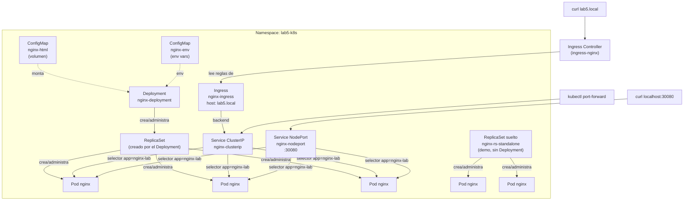

# Laboratorio 5 — Kubernetes local (Deployments, ReplicaSets, Services, Ingress, ConfigMaps)

Lab de infraestructura, sin código de aplicación: levanta un clúster de
Kubernetes **local** (Docker Desktop, minikube o kind) y despliega un
Nginx a través de los objetos básicos de Kubernetes, para practicar el
ciclo completo — manifiestos, `kubectl apply`, verificación, self-healing,
rolling update y limpieza — sin depender de un clúster en la nube.

## Objetivo

Cubrir, con un solo Nginx como carga de trabajo, los objetos de
Kubernetes más usados en el día a día:

- **Deployment** con **ReplicaSet** (y un ReplicaSet suelto de más, solo
  para comparar ambos niveles)
- **ConfigMap** usado de dos formas distintas: montado como volumen y
  inyectado como variables de entorno
- **Service** tipo **ClusterIP** (acceso interno) y tipo **NodePort**
  (acceso externo directo)
- **Ingress** con su Ingress Controller (enrutamiento por host)

## Arquitectura



## Prerrequisitos

- Un clúster de Kubernetes local, ya sea:
  - **Docker Desktop** con Kubernetes habilitado (recomendado en
    Windows/macOS; ya trae `kubectl`), o
  - [minikube](https://minikube.sigs.k8s.io/), o
  - [kind](https://kind.sigs.k8s.io/)
- `kubectl` en el PATH (se verifica con `kubectl version --client`)
- Pasos de instalación/activación detallados, comandos de verificación
  y troubleshooting: ver [INSTRUCCIONES.md](INSTRUCCIONES.md)

## Estructura de archivos

```
lab5/
├── README.md                          este archivo
├── CONCEPTOS.md                       teoría y buenas prácticas (labels vs annotations, tipos de Service, probes, QoS...)
├── INSTRUCCIONES.md                   guía paso a paso (setup, deploy, pruebas, limpieza)
└── manifests/
    ├── kustomization.yaml             permite aplicar todo con `kubectl apply -k`
    ├── 00-namespace.yaml              Namespace lab5-k8s
    ├── 01-configmap-html.yaml         ConfigMap montado como volumen (index.html)
    ├── 02-configmap-env.yaml          ConfigMap inyectado como variables de entorno
    ├── 03-deployment.yaml             Deployment (3 réplicas) que usa ambos ConfigMaps
    ├── 04-replicaset-standalone.yaml  ReplicaSet suelto, solo para comparar con el Deployment
    ├── 05-service-clusterip.yaml      Service ClusterIP (acceso interno)
    ├── 06-service-nodeport.yaml       Service NodePort :30080 (acceso externo directo)
    └── 07-ingress.yaml                Ingress por host (lab5.local) -> Service ClusterIP
```

## Qué hace cada manifiesto

| Archivo | Objeto | Para qué sirve |
|---|---|---|
| `00-namespace.yaml` | Namespace | Aísla todos los objetos del lab bajo `lab5-k8s`, sin chocar con otros namespaces del clúster. |
| `01-configmap-html.yaml` | ConfigMap | Contenido estático (`index.html`) que se **monta como volumen** en `/usr/share/nginx/html`, reemplazando la página default de Nginx. |
| `02-configmap-env.yaml` | ConfigMap | Configuración no sensible (`APP_ENV`, `LOG_LEVEL`, ...) inyectada como **variables de entorno** vía `envFrom`. Para datos sensibles se usaría un `Secret`, no un ConfigMap. |
| `03-deployment.yaml` | Deployment | Workload principal: 3 réplicas de Nginx, rolling update, probes de liveness/readiness, resource requests/limits. Crea y administra su propio ReplicaSet automáticamente. |
| `04-replicaset-standalone.yaml` | ReplicaSet | Ejemplo didáctico de un ReplicaSet creado **sin** un Deployment encima, para comparar: garantiza N réplicas (self-healing) pero no sabe hacer rolling update ni rollback. |
| `05-service-clusterip.yaml` | Service (ClusterIP) | IP virtual estable, solo accesible **dentro** del clúster; balancea entre los Pods del Deployment. Es el backend del Ingress. |
| `06-service-nodeport.yaml` | Service (NodePort) | Abre el puerto `30080` en el nodo (en clúster local = tu propia máquina): `http://localhost:30080` sin necesidad de port-forward ni Ingress. |
| `07-ingress.yaml` | Ingress | Enruta el host `lab5.local` hacia el Service ClusterIP. Requiere un Ingress Controller corriendo en el clúster (ver INSTRUCCIONES.md). |

## Quickstart

```bash
# 1. Verificar que el clúster local está corriendo
kubectl cluster-info

# 2. Aplicar todos los manifiestos de una vez (usa Kustomize integrado en kubectl)
kubectl apply -k manifests/

# 3. Verificar que todo quedó Ready
kubectl get all -n lab5-k8s

# 4. Probar el Service ClusterIP
kubectl port-forward -n lab5-k8s svc/nginx-clusterip 8080:80
# abrir http://localhost:8080 en el navegador

# 5. Probar el Service NodePort (sin port-forward)
curl http://localhost:30080

# 6. Limpieza
kubectl delete -k manifests/
```

Para instalar el Ingress Controller, probar el Ingress, forzar
self-healing, hacer un rolling update/rollback y ver troubleshooting
común, seguir la guía completa: **[INSTRUCCIONES.md](INSTRUCCIONES.md)**.

Para entender el *porqué* de cada decisión (labels vs. annotations,
cuándo usar cada tipo de Service, ConfigMap vs. Secret, probes, QoS de
recursos) y un checklist de buenas prácticas: **[CONCEPTOS.md](CONCEPTOS.md)**.

## Notas / alcance

- Pensado para clúster **local de un solo nodo** (Docker Desktop,
  minikube, kind). Los mismos manifiestos funcionan contra un clúster
  real, pero en la nube normalmente se preferiría un Service tipo
  `LoadBalancer` en vez de `NodePort` para exponer tráfico externo.
- No incluye `Secret`, `PersistentVolume`/`PersistentVolumeClaim`,
  `HorizontalPodAutoscaler` ni `NetworkPolicy` — quedan fuera del
  alcance pedido para este lab, pero son el siguiente paso natural
  sobre esta misma base.
