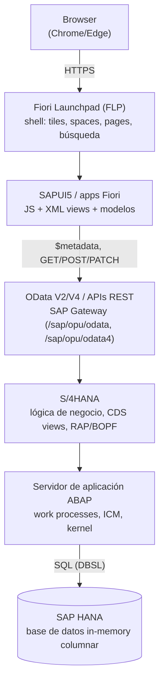

# Arquitectura de SAP S/4HANA con Fiori

```
Browser
   ↓
Fiori Launchpad
   ↓
UI5
   ↓
OData / API
   ↓
S/4HANA
   ↓
ABAP
   ↓
HANA
```

Cada flecha es una llamada real: el navegador pide HTML/JS, el JS
(UI5) pide datos por HTTP, el servidor ABAP los arma y HANA los lee. Las
capas se explican de arriba hacia abajo, siguiendo una petición.



## 1. Browser

Solo renderiza. Descarga el shell del Launchpad y las apps como
archivos estáticos (JS, XML, CSS, i18n) y ejecuta todo el código de UI
en el cliente. No hay lógica de negocio aquí. Habla HTTPS con el
servidor a través de un **Web Dispatcher** o reverse proxy (en
instalaciones reales) o directo al ICM del servidor ABAP.

## 2. Fiori Launchpad (FLP)

Es el **punto de entrada único** (shell), no una app de negocio.
Servicio en `/sap/bc/ui2/flp` (URL típica: `https://host:port/sap/bc/ui2/flp`).
Aporta:

- **Tiles / Spaces / Pages**: en S/4HANA moderno el contenido se organiza
  en *Spaces* y *Pages* (antes, *Groups* y *Catalogs*).
- **Navegación semántica**: cada tile apunta a un *Semantic Object +
  Action* (ej. `SalesOrder-display`), no a una URL fija. El FLP resuelve
  esa intención hacia la app concreta mediante *Target Mappings*.
- **Autorización**: solo ves los tiles cuyos catálogos/spaces están en
  tus roles (PFCG).
- Servicios compartidos: notificaciones, búsqueda, usuario, temas.

Configuración: Launchpad Designer / Content Manager (transacciones
`/UI2/FLPD_CUST`, `/UI2/FLPD_CONF`, `/UI2/FLP_CUS_CONF`).

## 3. SAPUI5 (frontend framework)

Framework JavaScript de SAP (OpenUI5 es la versión open source). Las
apps Fiori son apps UI5 con estructura MVC:

- **View** (XML): estructura visual con controles (`sap.m`, `sap.ui.table`,
  `sap.f`).
- **Controller** (JS): eventos y lógica de pantalla.
- **Model**: `ODataModel` (V2 o V4) que se conecta al backend,
  `JSONModel` para estado local.
- **manifest.json**: descriptor de la app (data sources, modelos,
  routing, dependencias). Es el archivo clave.

Tipos de app Fiori: *SAPUI5 freestyle*, **Fiori elements** (UI generada
desde anotaciones del backend: List Report, Object Page) y apps
analíticas. Con Fiori elements el 80 % del UI sale de **anotaciones CDS**,
sin escribir JS.

Las apps UI5 viven en el servidor ABAP como repositorio BSP y se
sirven como estáticos; el índice de librerías/apps se calcula con el
reporte `/UI5/APP_INDEX_CALCULATE` (una causa clásica de "la app no
carga").

## 4. OData / API (SAP Gateway)

Contrato entre UI y backend: REST sobre HTTP con metadatos (`$metadata`)
y consultas (`$filter`, `$select`, `$expand`, `$top`, `$orderby`).

- **OData V2**: `/sap/opu/odata/sap/<SERVICIO>_SRV`
- **OData V4** (RAP): `/sap/opu/odata4/sap/<servicio>/srvd/...`
- **CSRF token**: las escrituras (POST/PATCH/DELETE) exigen un token
  obtenido con `X-CSRF-Token: Fetch` en un GET previo.
- **SAP Gateway** (embebido en S/4HANA desde 1709): publica los
  servicios y verifica autorización. Se activan en `/IWFND/MAINT_SERVICE`
  (Add Service) y se depuran en `/IWFND/ERROR_LOG`.
- Hay también **APIs SOAP/REST** publicadas en el SAP Business
  Accelerator Hub para integración externa (aparte de las que consume
  la UI).

## 5. S/4HANA (lógica de negocio)

La aplicación de negocio: Finanzas, Compras, Ventas, Logística, etc.
Aquí viven:

- **CDS views** (Core Data Services): modelo de datos semántico sobre
  las tablas; capas *Basic → Composite → Consumption* (`I_`, `C_`).
  Las anotaciones (`@UI`, `@OData.publish`) definen cómo se ve y expone.
- **RAP** (ABAP RESTful Application Programming Model): modelo moderno
  para BOs con comportamiento (create/update/actions/validaciones);
  sustituye a BOPF/SEGW en desarrollo nuevo.
- **Clean core / extensibilidad**: *key user* (in-app), *developer*
  (ABAP Cloud, on-stack) y *side-by-side* (BTP).

## 6. ABAP (servidor de aplicación)

El runtime donde corre todo lo anterior: **AS ABAP**. Recibe la petición
por el **ICM** (Internet Communication Manager), un *work process*
(dialog) la ejecuta, y el código ABAP (clases, CDS, RAP) arma la
respuesta. Sesión, autorizaciones (objetos de autorización), locks y
transacciones de BD (`COMMIT WORK`) se gestionan aquí. Una instancia
tiene *ASCS* (mensajes/enqueue) + *PAS* (aplicación) y kernel `disp+work`.
Los servicios HTTP se activan en **SICF**.

## 7. HANA (base de datos)

Base de datos **in-memory, columnar**. En S/4HANA la lógica pesada se
"empuja hacia abajo" (*code pushdown*): las CDS views se traducen a SQL
que HANA ejecuta directo, en vez de traer filas al ABAP. ABAP se
conecta por **DBSL** (SQL nativo, `hdbsql`). Puertos habituales:
`3<NN>13` (SYSTEMDB) / `3<NN>15` (tenant) con NN = número de instancia.
Modelo simplificado vs. ECC: tablas agregadas eliminadas (ej. `MATDOC`
reemplaza `MKPF/MSEG`; `ACDOCA` = Universal Journal).

## Ejemplo de una petición completa

Usuario abre el tile "Manage Sales Orders":

1. Browser → `GET /sap/bc/ui2/flp` (carga shell) y luego el tile resuelve `SalesOrder-manage`.
2. FLP carga la app UI5: `manifest.json`, `Component.js`, vistas.
3. UI5 → `GET .../sap/opu/odata4/.../C_SalesOrderManage?$top=20&$filter=...`
4. Gateway valida sesión/rol → dispara la CDS view en ABAP.
5. ABAP genera SQL → **HANA** lo ejecuta en memoria.
6. Respuesta JSON viaja de vuelta y UI5 pinta la tabla.

## Variantes de despliegue (dónde vive el frontend)

| Modelo | Frontend server (FLP/UI5/Gateway) | Backend (S/4 + ABAP + HANA) |
|---|---|---|
| **Embedded** | Mismo sistema S/4HANA | Mismo sistema |
| **Hub** | Sistema Gateway/Fiori separado | S/4HANA + HANA |
| **Cloud (Work Zone)** | SAP Build Work Zone en BTP | S/4HANA Cloud o on-prem vía Cloud Connector |

Desde S/4HANA 1709 se recomienda **embedded** para on-prem nuevo.
