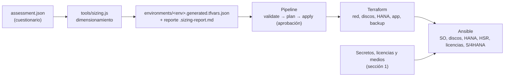

# Requisitos de inicio, assessment y dimensionamiento

Este es el punto de partida para automatizar el despliegue: se llena un
**assessment** (un archivo JSON), un script calcula el dimensionamiento y
genera las variables de Terraform, y el pipeline hace el resto. Lo único que
hay que aportar es lo de la sección 1 (licencias, contraseñas, medios y
accesos).



Documentos relacionados: [PREREQUISITOS.md](PREREQUISITOS.md) (por qué se pide
cada cosa), [terraform/README.md](terraform/README.md),
[pipelines/README.md](pipelines/README.md).

---

## 1. Lo que hay que entregar para arrancar

### 1.1 Licencias, secretos y medios (no van en el repositorio)

| Insumo | Para qué | Dónde se carga | Obligatorio |
|---|---|---|---|
| Licencia de SAP HANA (contenido del archivo) | `SET SYSTEM LICENSE` en el primario | Secret `HANA_LICENSE_TEXT` | No al inicio (hay licencia temporal), sí antes de vencer |
| Licencia ABAP de S/4HANA (archivo) | `saplikey -install` | Secret `S4_LICENSE_TEXT` | Igual que arriba; requiere el *hardware key* del sistema |
| Contraseña `SYSTEM` de HANA | Instalación y administración | Secret `HANA_SYSTEM_PASSWORD` | Sí |
| Contraseña `<sid>adm` de HANA | Instalación | Secret `HANA_SIDADM_PASSWORD` | Sí |
| Contraseña `sapadm` | Instalación del host agent | Secret `HANA_SAPADM_PASSWORD` | Sí |
| Contraseña maestra de S/4HANA | SWPM | Secret `S4_MASTER_PASSWORD` | Solo si se instala S/4HANA |
| Medios de SAP (HANA, SWPM, S/4HANA) | Instalación | Bucket S3 propio (`SAP_MEDIA_BUCKET`), rutas `hana/` y `s4hana/` | Sí |
| ID de producto de SWPM | Instalación desatendida | Variable `SWPM_PRODUCT_ID` | Solo si se instala S/4HANA |
| Rol IAM para el pipeline (OIDC) | Que el pipeline cree la infraestructura | Variable `AWS_ROLE_ARN` | Sí |
| Bucket y tabla del estado de Terraform | Estado remoto con bloqueo | Variables `TF_STATE_BUCKET`, `TF_STATE_LOCK_TABLE` | Sí |
| Suscripción de SO (SLES/RHEL for SAP) o `ami_id` | Imagen de las instancias | Marketplace / campo `os.ami_id` | Sí |

Los medios de SAP se descargan con un S-user y su acceso está sujeto al
contrato de licencia, por eso no se automatiza la descarga: se suben una vez
al bucket propio.

Estructura esperada del bucket de medios:

```
s3://<SAP_MEDIA_BUCKET>/
├── hana/      DATA_UNITS/HDB_LCM_LINUX_X86_64/hdblcm, ...   (medio de HANA descomprimido)
└── s4hana/    SWPM/sapinst, ... (SWPM + medios de S/4HANA)
```

Si tu medio de HANA tiene otra estructura, ajustar `hana_lcm_path` en
[ansible/group_vars/all.yml](ansible/group_vars/all.yml).

### 1.2 Decisiones de negocio y técnicas (van en el assessment)

Ver el cuestionario de la sección 2.

---

## 2. Cuestionario de assessment

Se responde en un archivo JSON copiado de
[assessment/assessment.example.json](assessment/assessment.example.json).
Cada pregunta indica la clave que llena.

### 2.1 Alcance y entorno

| Pregunta | Clave | Ejemplo |
|---|---|---|
| ¿Qué entorno es? (`dev`, `qas`, `prd`) | `environment` | `dev` |
| ¿Región de AWS? | `region` | `us-east-1` |
| ¿Nombre del proyecto (prefijo de recursos)? | `project` | `s4hana` |
| ¿Número de instancia SAP (dos dígitos)? | `sap_instance_number` | `00` |

### 2.2 Dimensionamiento

| Pregunta | Clave | Cómo obtenerla |
|---|---|---|
| RAM de HANA según el sizing oficial | `sizing.hana_ram_gb_from_quicksizer` | SAP Quick Sizer (proyecto nuevo) o reporte `/SDF/HDB_SIZING` (migración) |
| Crecimiento anual de datos (%) | `sizing.growth_percent_per_year` | Histórico o proyección del negocio |
| Años a cubrir | `sizing.planning_years` | 3 a 5 |
| Usuarios concurrentes (dialog + Fiori + API) | `sizing.concurrent_users` | Pico real, no usuarios nombrados |

### 2.3 Continuidad

| Pregunta | Clave | Efecto |
|---|---|---|
| RPO máximo aceptable (minutos) | `continuity.rpo_minutes` | RPO 0 activa alta disponibilidad |
| RTO máximo aceptable (minutos) | `continuity.rto_minutes` | RTO ≤ 30 activa alta disponibilidad |
| ¿Se requiere DR en otra región? | `continuity.dr_region_required` | Solo genera una advertencia: la plantilla no crea DR |
| Días de retención de backups | `backup.retention_days` | Ciclo de vida del bucket |

### 2.4 Red y acceso

| Pregunta | Clave | Restricción |
|---|---|---|
| Rango de la VPC | `network.vpc_cidr` | Debe ser `A.B.0.0/16`; las subredes se derivan de él |
| ¿Desde qué IP/rangos se administra? | `network.admin_cidrs` | Lista de CIDR; `0.0.0.0/0` se rechaza |
| AMI propia (opcional) | `os.ami_id` | `null` = buscar SLES for SAP en Marketplace |

### 2.5 Preguntas que no llenan una clave, pero hay que responder

Estas decisiones condicionan el proyecto aunque el script no las use. Las
respuestas justifican el sizing y deben quedar documentadas junto al assessment.

| Tema | Preguntas |
|---|---|
| Licencias | Modalidad contratada, tipos y cantidad de usuarios, métrica de volumen, HANA runtime vs. *full-use* |
| Datos | Estrategia (greenfield / brownfield), volumen a migrar, datos a archivar, anonimización de datos de prueba |
| Seguridad | Proveedor de SSO, MFA, marcos de cumplimiento aplicables, gestor de secretos |
| Integraciones | Cantidad y tipo de interfaces (IDoc, OData, API), volúmenes y horarios |
| Operación | Ventanas de mantenimiento, monitoreo, responsables de Basis |

Detalle de cada tema: [PREREQUISITOS.md](PREREQUISITOS.md).

---

## 3. Reglas de dimensionamiento (las que aplica el script)

| Cálculo | Regla |
|---|---|
| RAM requerida | `RAM Quick Sizer × (1 + crecimiento %)^años` |
| Instancia HANA | La más pequeña de [tools/instance-catalog.json](tools/instance-catalog.json) con RAM ≥ la requerida |
| Disco `data` | 1.2 × RAM |
| Disco `log` | 0.5 × RAM, máximo 512 GB |
| Disco `shared` | 1 × RAM, máximo 1024 GB |
| Disco `backup` | 2 × RAM |
| IOPS / rendimiento | Escalones por RAM: ≤ 256 GB, ≤ 512 GB, mayor (gp3, tope de 16 000 IOPS y 1 000 MB/s) |
| Servidores de aplicación | Los necesarios para cubrir `concurrent_users` (150 / 300 / 600 usuarios por servidor según el tipo) |
| Alta disponibilidad (HSR) | Sí si RPO = 0 o RTO ≤ 30 min |

Estas son reglas de partida. **El catálogo de instancias no está verificado**
contra el directorio de plataformas certificadas de SAP (el script lo
advierte en cada corrida): confirmar el tipo elegido, validar el rendimiento
de los discos con HCMT y ajustar las reglas con los datos de tu sizing real.

## 4. Uso

```bash
cp lab6/assessment/assessment.example.json lab6/assessment/mi-dev.json   # editar
node lab6/tools/sizing.js lab6/assessment/mi-dev.json
```

Ejemplo de salida con el assessment de ejemplo:

| Concepto | Valor |
|---|---|
| RAM según Quick Sizer | 200 GB |
| Crecimiento | 15 %/año × 3 años |
| RAM requerida proyectada | 305 GB |
| Instancia HANA elegida | r6i.12xlarge (384 GB) |
| Discos HANA | data 461 / log 192 / shared 384 / backup 768 GB |
| Servidores de aplicación | 1 × m6i.2xlarge |
| Alta disponibilidad | No |

Genera `terraform/environments/<env>.generated.tfvars.json` (ignorado por Git)
y `assessment/<env>.sizing-report.md`. Con esos valores, el pipeline ejecuta
Terraform y Ansible: ver [pipelines/README.md](pipelines/README.md).

## 5. Instalación de S/4HANA con SWPM (paso que requiere trabajo previo)

Terraform y Ansible dejan HANA instalado, replicado y licenciado. La
instalación de S/4HANA con SWPM en modo desatendido depende del release y no
se puede inventar de forma genérica:

1. Ejecutar SWPM **una vez de forma interactiva** con tu release hasta la
   pantalla de resumen y guardar el archivo de parámetros que genera.
2. Pegarlo en
   [ansible/roles/s4_install/templates/s4_inifile.params.j2](ansible/roles/s4_install/templates/s4_inifile.params.j2),
   sustituyendo los secretos por variables (`{{ s4_master_password }}`) y quitando la marca
   `CAMBIAR_ANTES_DE_USAR` (el rol se detiene mientras exista).
3. Definir `SWPM_PRODUCT_ID` y lanzar el pipeline con `run_s4_install = true`.

## 6. Qué NO está automatizado

- Descarga de medios de SAP (requiere S-user y aceptar licencia).
- Configuración del clúster Pacemaker, fencing e IP virtual para conmutación automática (la replicación HSR sí se configura).
- DR en otra región.
- Activación de Fiori (ver [INSTALACION.md](INSTALACION.md)) y configuración funcional del negocio.
- Web Dispatcher / balanceador y certificados TLS de una CA.
